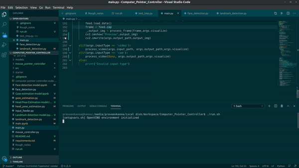
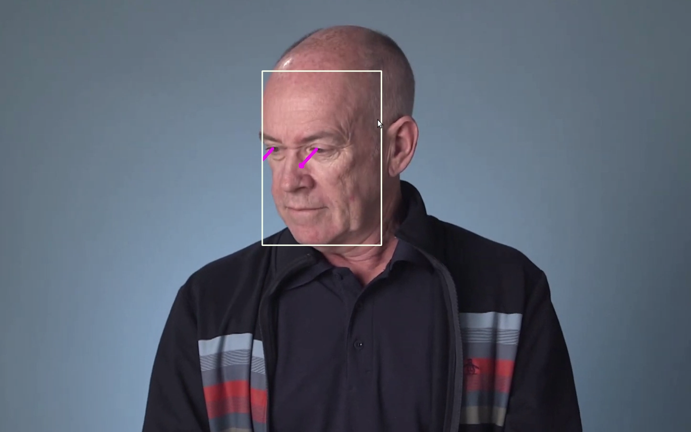
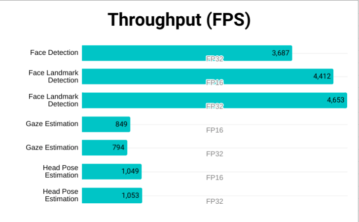
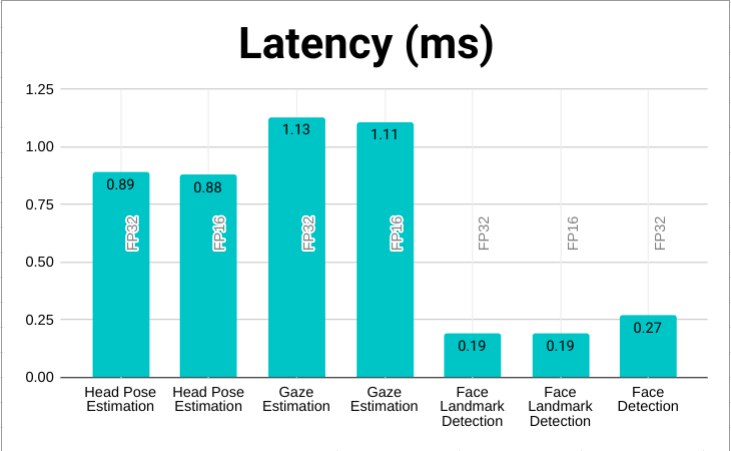
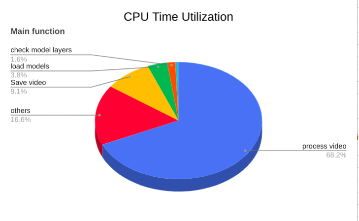
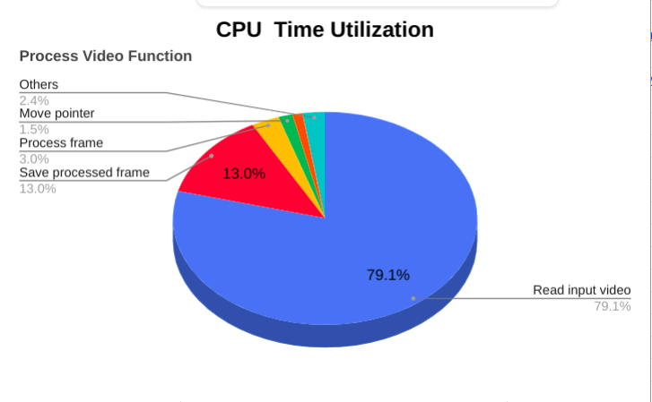

# Computer Pointer Controller

The application tracks the eye movement from the video feed and controls the movement of the mouse pointer.

# How it Works
The application uses 4 deeplearning models. Each frame in the video is processed to crop the face, identify left and right eye, crop left and right eye, estimate the headpose of the face and finally get x and y axis from gaze estimation model to control the mouse. The design pipeline is as follows.

# Project Setup

## Project Setup on Ubuntu machine
* Download the deployement package from `deployement_Ubuntu_18.04.4 LTS/deploy_package.tar.xz`
* Extract the archive.
* Open the terminal from the extracted archive folder
* To install dependency execute the following command
<pre>sudo ./install_dependency.sh</pre>
 
* To check whether it is working properly. Run the demo script.
<pre>./demo-script.sh</pre>
<b>Note:</b> The package is built using OpenVino deployment manager.
  <table>
  <tr>
    <td></td>
  </tr>
 </table>

## Project Setup on Windows or Mac
* Clone this repository using Git.
<pre>git clone 'https://github.com/jpraveenkanna/Computer_Pointer_Controller.git'</pre> 

* Install OpenVino 2020. The instructions are available [here.](https://docs.openvinotoolkit.org/latest/_docs_install_guides_installing_openvino_windows.html)

* Create Virtual environment inside the cloned folder. <pre>python3 -m venv bin/venv</pre>

* Install python dependencies. <pre>pip3 install -r requirements.txt</pre>

## Demo

* Intialize openvino in the terminal.
* Activate the virtual environment. <pre>bin/venv/bin/activate</pre> 
* To control mouse pointer on the sample video. Run the following python script. <pre>python src/main.py -i "bin/inputs/demo.mp4" -o "bin/outputs/demo_out.mp4" --inputType "video" --mouse_speed "fast" --mouse_precision "medium" --visualize "True"</pre>
* To control mouse pointer on the camera feed. Run the following python script. <pre>python src/main.py  -o "bin/outputs/cam_out.mp4" --inputType "video" --mouse_speed "fast" --mouse_precision "medium" --visualize "True"</pre>

* To stop the application press `esc` key.

# Folder Structure

* `src/face_detection.py` - Python script to handle face detection model.
* `src/gaze_estimation.py` - Python script to handle gaze estimation model.
* `src/head_pose_estimation.py` - Python script to handle headpose estimation model.
* `src/landmark_detection.py` - Python script to handle face landmark detection model.
* `src/mouse_controller.py` - Script to control mouse movement.
* `src/input_feeder.py` - Script to load video frame to the model.
* `src/main.py` - The main python script to run the application.
* `models` - Contains models of different precision.
* `deployement_Ubuntu_18.04.4 LTS` - Deployement package for Linux machine.
* `bin/inputs` - Contains sample input video.
* `demo-script.sh` - Bash script to run the demo.
* `requirements.txt` - Python package dependencies list.

## Documentation
Arguments to  run `main.py` script.  

<b>Required arguments:</b>
<table>
    <tr>
    <td> --inputType  </td>
    <td>Type of video input. Options - [video,cam,image]</td>
  </tr>
  <tr>
    <td>--output_path</td>
    <td>Save path for the video file</td>
  </tr>
  </table>

<b>Optional arguments:</b>
<table>
    <tr>
    <td> --help   </td>
    <td>show this help message and exit</td>
  </tr>
  <tr>
    <td>--input_path </td>
    <td>Input path of video file to run the application</td>
  </tr>
   <tr>
    <td>--mouse_precision </td>
    <td>Mouse movement precision. Options - [low, medium,high]</td>
  </tr>
   <tr>
    <td>--mouse_speed</td>
    <td> Mouse movement speed. Options -[slow, medium, fast]</td>
  </tr>
   <tr>
    <td>--face_detection_model </td>
    <td>Path of face detection model without file extension</td>
  </tr>
   <tr>
    <td>--landmark_detection_model </td>
    <td>Path of landmark detection model without file extension</td>
  </tr>
   <tr>
    <td>--head_pose_estimation_model</td>
    <td>Path of headpose estimation model without file extension</td>
  </tr>
   <tr>
    <td>--gaze_estimation_model </td>
    <td>Path of Gaze estimation model without file extension</td>
  </tr>
   <tr>
    <td>--device  </td>
    <td>Target hardware type to run inference on. Options -[CPU, GPU, FPGA, MYRIAD]</td>
  </tr>
   <tr>
    <td>--visualize  </td>
    <td>To visualize model intermediate output. Options - [True,False]</td>
  </tr>
  </table>

## Benchmarks
### Comparing Model Performance
  <table>
  <tr>
    <td></td>
  </tr>
  <tr>
    <td></td>
  </tr>
  <tr>
    <td></td>
  </tr>
  </table>

### CPU Utilization of the Main function

### CPU Utilization of the Process Video function
  
<b>Note: </b> 
* Used DL Workbench and Vtune Profiler to get the results.
* All results are performed in Intel(R) Core(TM) i3-8130U CPU @ 2.20GHz

## Results
* On running in CPU the inference performance between FP32 and FP16 precisions is too low. But CPU load can be reduced when running on GPU.
* On running on GPU face detection model took 8 seconds to load and other models took around 2 seconds each to load. So the load time is comparitively high when compared to CPU.
* The preprocessing and postprocessing of the frames took less that 0.4% of overall CPU time. Saving the video function took 9% of overall CPU time. Loading the video frame for process took about 79% of process video function.
* Checking model layer support of a device took 1.6% and loading the model took 3.8% of overall CPU time.

### Edge Cases To Consider
* Decent lighting condition is necessary to identify the face.
* If two or more face is available only one face is tracked to control mouse. It depends on the confidence of the face detection model.
* A frame is processed for every 10 frames. so sudden movements cannot be tracked.

